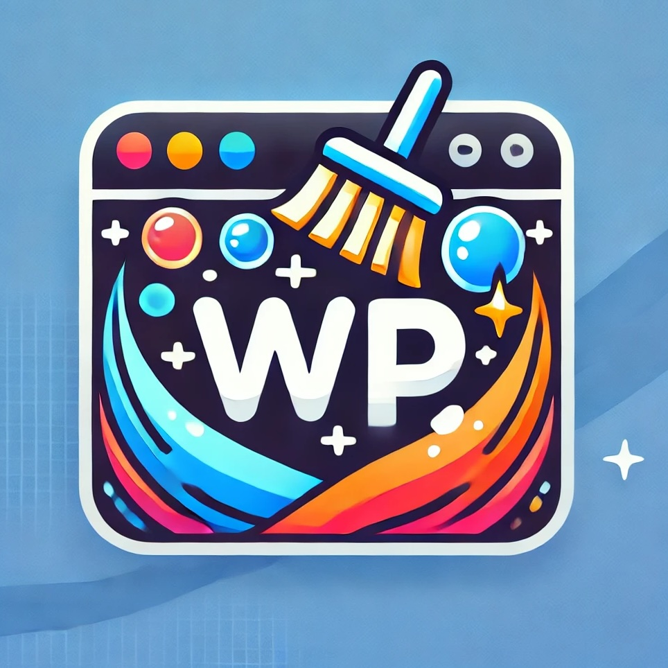

<p align="center">
    
</p>

<h1 align="center">WPcom Cleanser</h1>

It's a browser extension created specifically for WordPress.com Code Wranglers. This tool simplifies the process of cleaning up websites, different subscriptions, and domains. Previously, developers had to do it manually through the UI, navigating multiple pages, prompts and steps for each item. This extension saves valuable time and dramatically reduces manual work, allowing developers to complete the cleanup with just one button click.

<table>
    <tr>
        <td>
        <td>
    </tr>
</table>

## Features
1. Cancel subscriptions and remove them (https://wordpress.com/me/purchases).
At the moment we support only:
    - Domain registration
    - Wordpress.com plans
    - Titan
    - Google Workspace
2. Delete sites (https://wordpress.com/sites)
3. Remove A4A sites from dashboard (https://agencies.automattic.com/sites)

## Installation
Follow these steps to set up WPcom Cleanser:
1. Clone the repository:
```
git clone git@github.com:nightnei/wpcom-cleanser.git
```
2. Open Chrome and navigate to chrome://extensions/
3. Enable Developer Mode (top right corner)
4. Click on “Load unpacked” and select the cloned repository folder
5. The extension should now be visible in your extensions list

## Usage Instructions
1. Open the Extension: Click the "WPcom Cleanser" icon in your Chrome toolbar
2. Click on the "Settings" button in the top right corner and follow the instructions for "Authorization header"
3. Click "Save settings"
4. Have fun!

## Troubleshooting & Notes
1. Sometimes you can encounter errors with A4A sites deletion. It's expected, since deletion of their plans takes some time at the backend. Just try to delete them again in 1-2 minutes.
2. The extension removes items sequentially, so keep it open until the process completes. This approach avoids overloading our servers. We may later rewrite it to send all requests simultaneously.

## Contacts
If you encounter issues or need new functionality, create a branch with proposed changes or add an issue to this repo.
For questions, mention me (@nightnei) here or on Slack.